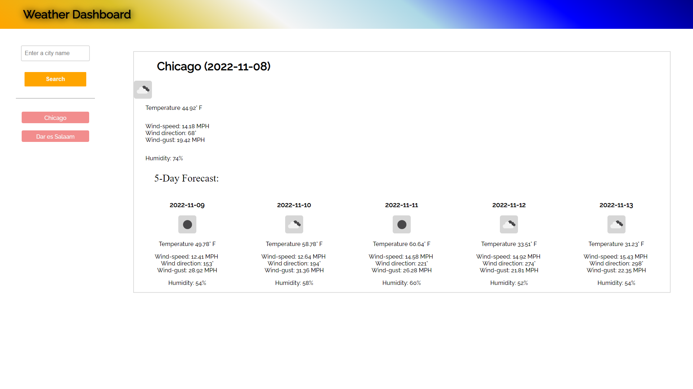

# Weather-dashboard
## A simple weather web app.

This application displays the current and 5-day weather forecast of any city the user inputs.
The information presented includes temperature, wind speed, wind direction, wind gust, and humidity.

[Deployed Site](https://jioriatti.github.io/weather-dashboard/)
